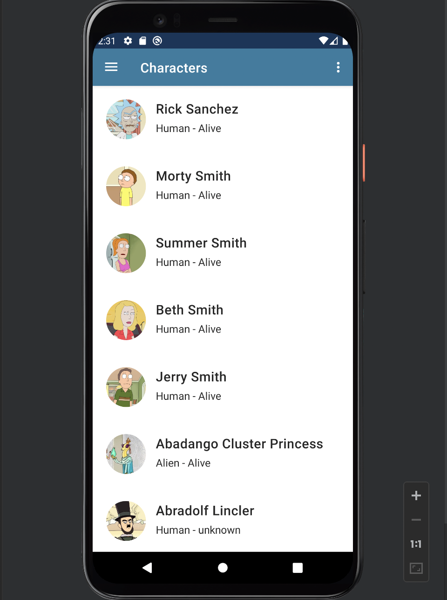
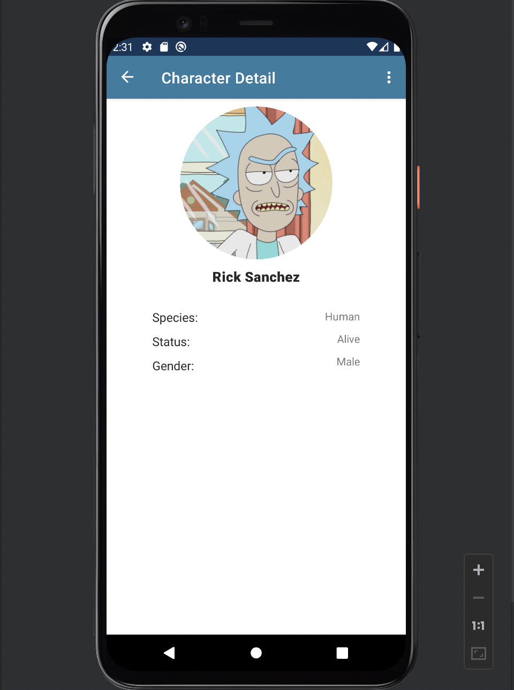

# Rick And Morty
This is an app that for fans of Rick and Morty - American adult animated science fiction sitcom.

## Requirements
1. Maximum one page description of the project, main features
2. Usage of network requests using Retrofit2
3. Usage of local database using Room
4. Usage of dependency injection
5. Well designed architecture MVP or MVVM
6. All features described in step 1 must be finished and tested. Without any
crashes and bugs.
7. GitHub repo with well described Readme.md

## Libraries and technologies used
A Rick And Morty simple app that loads information from The Rick and Morty API to show one approach to using some of the best practices in Android Development. Including:
* ViewModel
* LiveData
* Hilt (for dependency injection)
* Retrofit
* Room
* Navigation
  
## Screenshots
### Main Page

### Detail Page

## License
This repository is released under the [MIT license](LICENSE.md). In short, this means you are free to use this software in any personal, open-source or commercial projects. Attribution is optional but appreciated.